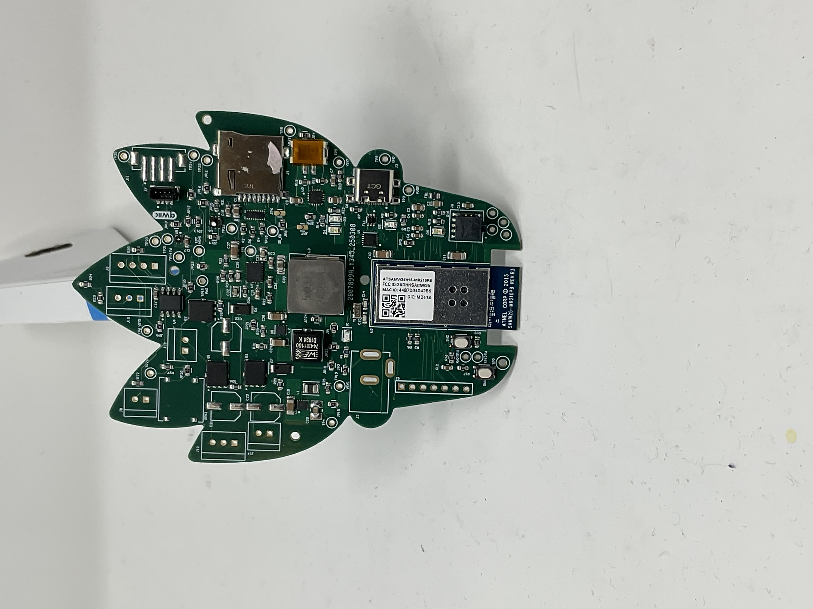
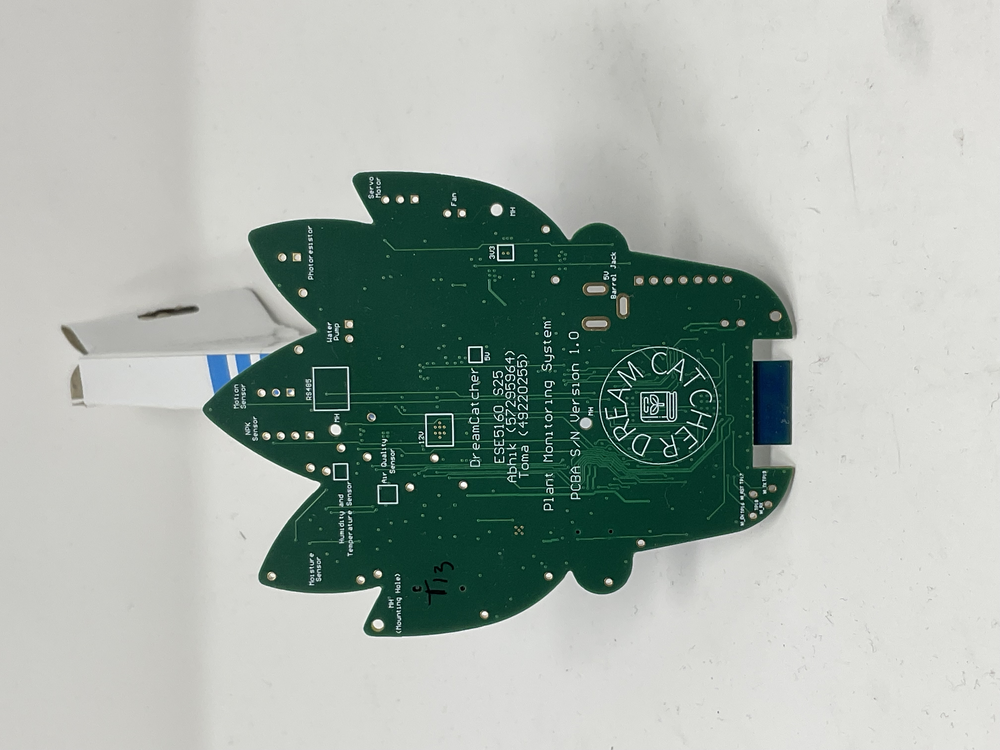
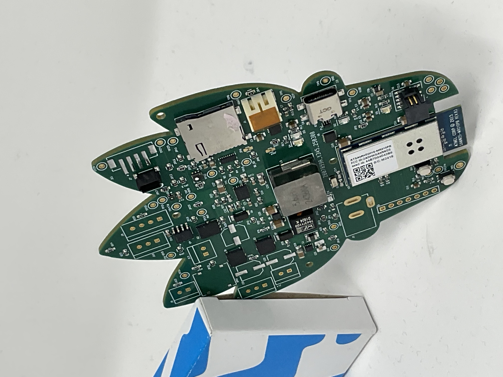
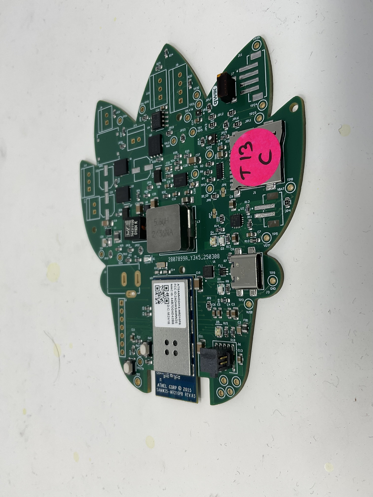
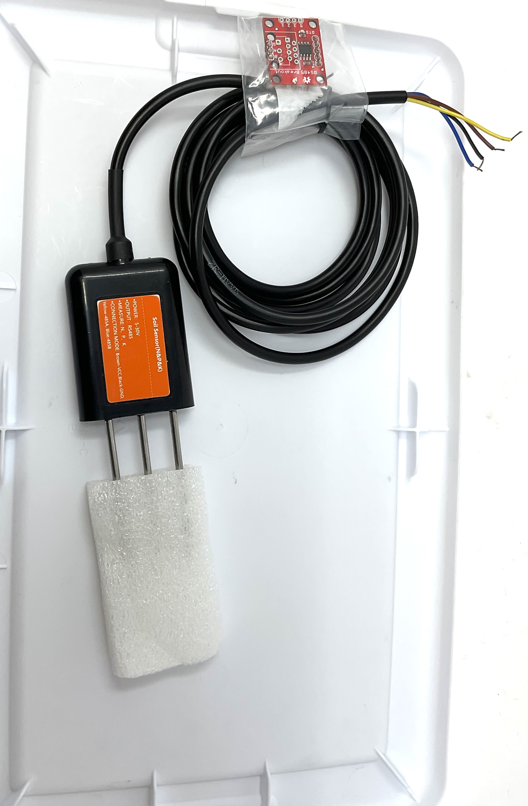
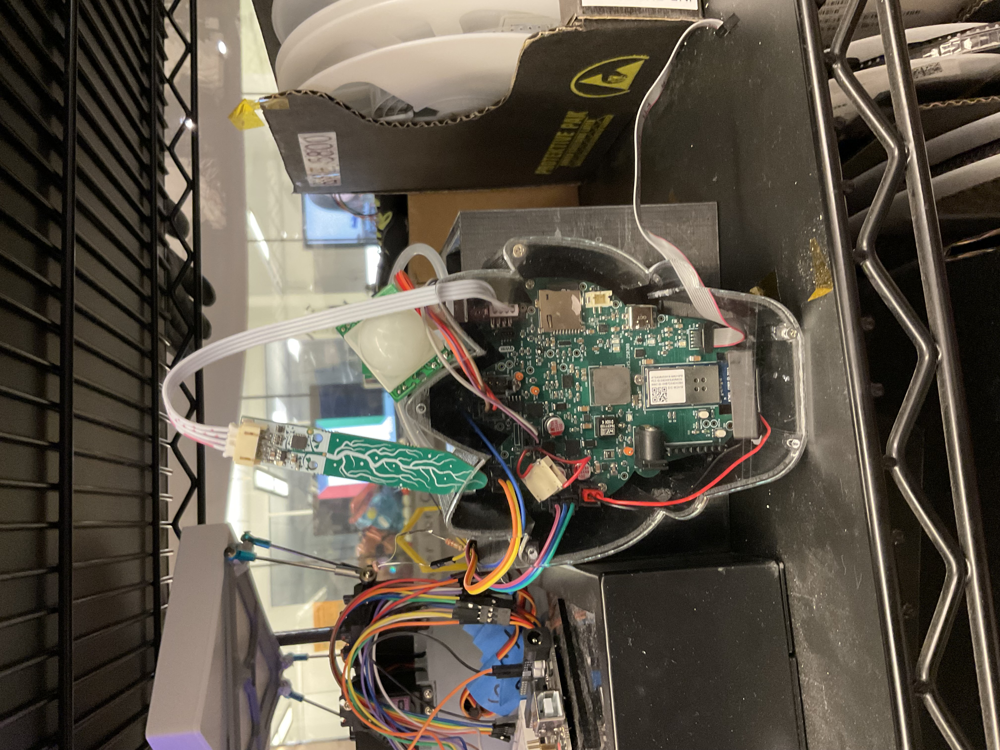
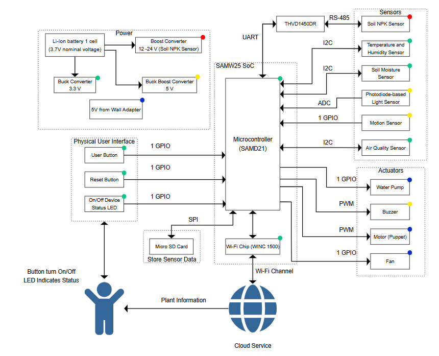

## Team Details

- **Team Number:** T13  
- **Team Name:** DreamCatcher  
- **Team Members:**  
  - Abhik Kumar  
  - Toma Yasuda
- **GitHub Repository URL:** [LINK](https://github.com/ese5160/final-project-t13-dreamcatcher)
- **Website Link:** [LINK](https://ese5160.github.io/PLANT_SURVIVAL_SYSTEM/)
- **Node Red UI:** [LINK](http://172.191.193.66:1880/ui/)

---

## Project Pics

 

Team DreamCatcher at Demo Day – showcasing their innovative plant monitoring system and receiving recognition for their work.

    

    

Hardware views of the plant monitoring system – highlighting sensor integration, compact design, and component layout from multiple angles.

## 1. Video Presentation

- Link: [https://youtu.be/Ixd16mNeDC0](https://youtu.be/Ixd16mNeDC0)
  

  <iframe 
    src="https://www.youtube.com/embed/Ixd16mNeDC0" 
    frameborder="0" 
    allow="accelerometer; autoplay; clipboard-write; encrypted-media; gyroscope; picture-in-picture; web-share" 
    allowfullscreen 
    style="position: absolute; top:0; left: 0; width: 100%; height: 100%;">
  </iframe>

---

## 2. Project Summary

### Device Description

The **Plant Survival System** is a real-time environmental sensing and response unit designed to automate plant care and provide rich telemetry via the Internet. Built on a SAMD21 microcontroller with FreeRTOS, it integrates sensors and actuators for smart irrigation, climate monitoring, and deterrence systems.

We were inspired by the lack of reliable, scalable, and low-power plant monitoring solutions suitable for both indoor and outdoor use. This device helps automate watering, air quality tracking, and soil nutrient monitoring — solving problems for both hobbyists and agriculture tech use cases.

### How the Internet Augments Functionality

The system uses Wi-Fi (via the SAMW25 chip) to send live sensor data to a **Node-RED dashboard**, enabling real-time remote monitoring. It also supports **Over-The-Air (OTA) updates** and **email notifications**, expanding usability and eliminating the need for physical intervention. All key data (e.g., soil moisture, air quality, NPK) is visualized remotely, enabling data-driven plant care.

---

### Device Functionality

The device architecture includes:

- **Sensors:**  
  - SHT4x (Temperature & Humidity via I2C)  
  - STEMMA Soil Sensor (Moisture & Temperature via I2C)  
  - SGP40 (Air Quality VOCs via I2C)  
  - Photoresistor (Analog input via ADC)  
  - PIR Motion Sensor (Digital input via GPIO interrupt)  
  - UART-based NPK Sensor via RS485  

- **Actuators:**  
  - DC Water Pump (GPIO trigger)  
  - Fan (GPIO  trigger)  
  - Buzzer (PWM via TCC2 on PA17)  
  - Servo-based Puppet (PWM via TCC0 on PA10)  

- **MCU Platform:**  
  - SAMD21 Cortex-M0+ running FreeRTOS  
  - Node-RED UI hosted via Wi-Fi on SAMW25  

---

### Challenges

- **Firmware:**  
  Integrating blocking UART-based sensors like the NPK required timeout-based non-blocking reads to prevent task starvation.

- **Hardware:**  
  Conflicts in timer and PWM channel assignments (TCC/TC) required a full mapping overhaul. We assigned unique TCC instances per actuator.

- **Integration:**  
  Debugging I2C bus stability involved using stronger pull-up resistors and reducing communication frequency to ensure reliability.

---

### Prototype Learnings

- Plan all **TCC and pin muxing** early — same TCC can't drive multiple wave outputs on separate pins without conflict.
- Ensure **timeout-based UART drivers** for all serial sensors — avoids blocking FreeRTOS tasks.
- Implement **stack monitoring** with `uxTaskGetStackHighWaterMark` to catch task crashes during integration.
- For environmental sensors, keep **airflow consistent** using fans and avoid proximity to heat sources like regulators.

**If we built it again:**
- Use SAMD51 for more timers and memory  
- Add BLE for smartphone pairing  
- Use waterproof casings and modular connectors  

---

### Next Steps & Takeaways

- Integrate **weather forecast APIs** to override watering logic
- Add **capacitive touch** or push-button for manual override
- Switch to **low-power sleep mode** and use interrupts to wake up
- Extend Node-RED UI with user authentication and logging history

### What We Learned in ESE5160

This course taught us complete embedded prototyping from hardware interfacing to cloud integration. We learned:

- FreeRTOS task scheduling and memory debugging  
- Real-time sensor management using I2C, UART, and ADC  
- Building asynchronous, non-blocking device drivers  
- Using Node-RED for UI + MQTT for IoT data streams  
- Designing reliable firmware and PCBs with Altium  
  
### Project Links

- **Node-RED Flow:** [LINK](http://172.191.193.66:1880/ui/)

- **Altium Design:** [LINK](https://upenn-eselabs.365.altium.com/designs/F10B40A4-B2BE-4F72-AF76-706C91D55F7E)

---

## 3. Hardware & Software Requirements

### Hardware Requirements Specification (HRS)

#### Overview
The IoT Plant Monitoring System was developed for real-time plant health monitoring and management using a combination of sensors and actuators. The system was powered by the SAMW25 microcontroller, which provided integrated Wi-Fi communication for data sharing and supported peripherals for environmental monitoring and actuation.

The hardware integrated soil moisture sensors, temperature and humidity sensors, a light sensor, motion sensor, air quality sensor, and a soil NPK sensor. Actuators such as a water pump and motion deterrent system ensured automated responses. The system also featured a microSD card for efficient data logging.

#### Definitions and Abbreviations
- **SAMW25**: Microcontroller with integrated Wi-Fi
- **RTOS**: Real-Time Operating System
- **Li-ion**: Lithium-ion battery

#### Functional Requirements

- **HRS 01**: The SAMW25 microcontroller was used for processing, Wi-Fi communication, and interfacing with peripherals via I2C, SPI, UART, and GPIO.

- **HRS 02**: A capacitive soil moisture sensor measured soil water content (±3% accuracy) via I2C and triggered a water pump when moisture dropped below 30%.

- **HRS 03**: A SHT4x sensor measured temperature and humidity with ±0.5°C and ±2% accuracy. It is used to monitor the environmental condition to help provide the suitable care based on the data.

- **HRS 04**: A photodiode-based light sensor interfaced via ADC and detected lux levels (±2 lux). It helped disable sensors at night to save power.

- **HRS 05**: A soil NPK sensor (via RS485 + UART) measured nitrogen, phosphorus, and potassium levels. It requires only 5V and RS485 module is powered via a separate system based on the rating (3.3v or 5V module).

- **HRS 06**: A DC water pump (500 ml/min) was activated via GPIO based on soil moisture and adjusted for temperature and weather.

- **HRS 07**: A PIR motion sensor detected objects within 50 cm and triggered a buzzer via GPIO for 5 seconds.

- **HRS 08**: RC filter to get the reference voltage of ADC to the value comparable for microcontroller and reduce the noise in the signal too.

- **HRS 09**: The system ran on a 3.7V 2500mAh Li-ion battery with buck and boost converters for 3.3V, 5V, and 12V lines.

- **HRS 10**: A microSD card (via SPI) logged data from sensors and firmware images.

- **HRS 11**: A PWM-controlled motor-driven puppet was activated on motion detection to deter animals.

- **HRS 12**: Power and barrel LEDs provided system status.

- **HRS 13**: RS485 interfaced with the NPK sensor and was powered by a 12V boost converter (Can also be powered by 5V based on testing).

- **HRS 14**: An SGP40 sensor monitored VOC levels (0–1000 ppm) via I2C.

- **HRS 15**: A 5V wall adapter powered high-current devices like the pump and fan.

---

### Software Requirements Specification (SRS)

#### Overview
The system software managed real-time sensor data collection, automated actuation, and remote monitoring through Wi-Fi. It was developed using FreeRTOS and integrated cloud support.

#### Definitions and Abbreviations
- **Web Interface**: Platform for user interaction and control
- **Wi-Fi**: Wireless communication protocol
- **MQTT**: Publish-subscribe based messaging protocol for communication

#### Functional Requirements

- **SRS 01**: Sensor data was collected every 1 minute with ±1% sampling accuracy.

- **SRS 02**: Wi-Fi transmitted real-time soil moisture, soil temperature, air temperature, air humidity, air quality, light intensity, nitrogen, phosphorus, and potassium data to the cloud.

- **SRS 03**: NPK levels shall be measured every minute. Alerts shall be generated by sending email if nutrient levels dropped below thresholds.

- **SRS 04**: The water pump activated below 400 soil moisture capacitive value and turned off when moisture reaches the set value. 

- **SRS 05**: The PIR motion sensor activated a buzzer, fan and puppet deterrent for 5 seconds upon motion. It was overrideable by button.

- **SRS 06**: Over the Air firmware update on button click for the GUI.

- **SRS 07**: Notifications were sent via email to alert users about critical conditions like temperature extremes or low nutrients.

- **SRS 08**: Real-time and historical data were visualized through a web interface with graphs and system status.

- **SRS 09**: A microSD card logged timestamped data and used a rolling buffer to manage storage. Data synced with cloud when Wi-Fi was available.

- **SRS 10**: The fan also switches on based on motion or over heating to maintain airflow for stable sensor readings.

---

## 4. Project Photos & Screenshots

### 3D Model for Case

  

### The Altium Board design in 2D view

    

[OUTPUT JOB PDF](IMAGES/T13_S25_OutputJob_File.PDF)

### The Altium Board design in 3D view

      

[3D PDF use Adobe](IMAGES/3D_PCB.pdf)

Design-to-hardware pipeline – starting with vector outlines in Adobe Illustrator, imported into SolidWorks for 3D modeling, then integrated into Altium Designer to finalize the board shape and electrical layout.

### The standalone PCBA

</img> </img> 
</img> </img> 

Manufactured PCBAs – final assembled boards from our custom design, ready for integration and testing.

### Thermal camera images while the board is running under load
    
    

   

  

     

System under load testing – validating sensor stability, power management, and communication reliability under operational conditions.

### External sensor

    

External NPK sensor (UART, Model: DFROBOT SEN-0462) and soil moisture & humidity sensor (I2C, Model: Stemma) were used to monitor soil health while keeping the main board safe from moisture and corrosion.

### Node-RED Dashboard:

Node-RED Dashboard – visualizing real-time sensor data and system control interface for the plant monitoring application.

### Node-RED Backend:

Node-RED backend dashboard – featuring real-time visualization, control logic, and wireless data monitoring interface.

---

### Block diagram of the system:

Comprehensive system diagram – illustrating the functional flow of data between sensors, microcontroller, communication modules, and cloud interface, along with power distribution showing how each component is powered within the plant monitoring setup.

---

## 5. Codebase

- **Embedded C firmware:** [LINK](https://github.com/ese5160/final-project-t13-dreamcatcher/)
  
- **Node-RED Flow:** [LINK](http://172.191.193.66:1880/ui/)

- **Node-RED dashboard code:**[LINK](https://github.com/ese5160/final-project-t13-dreamcatcher/blob/main/Node-RED/node-red-final.json)

- **Altium Design:** [LINK](https://upenn-eselabs.365.altium.com/designs/F10B40A4-B2BE-4F72-AF76-706C91D55F7E)
  
- **BOM:** [LINK](IMAGES/A01G_BOM_[DreamCatcher]_Team_13.xlsx)

- **Additional Tools:** 
  - Microchip Studio for development
  - Python scripts were used to update the Wi-Fi driver
  - VS code for code search and navigation
  - Saleae Logic Analyzer for waveform analysis
  - Lab Oscilloscope and power supply for testing
  - Custom queue manager for data handling
  - UART timeout-based reading logic for NPK
  - PWM duty-cycle tuning routines for buzzer and fan

---

## Task Breakdown

| Task                    | Description                                       |
|-------------------------|---------------------------------------------------|
| SPI  TASK               | SD Card communication                             |
| I2C Task                | SHT4x, Soil Sensor, SGP40 polling                 |
| ADC Task                | Photoresistor peak sampling                       |
| UART Task               | NPK sensor polling with timeout protection       |
| Motion Handler Task     | Interrupt-based motion activation + actuation    |
| Schedule Task           | Aggregates all sensors and manages pump logic    |

---

## Notes

- Buzzer is driven using TCC2 on PA17
- Servo Motor is driven by TCC1 on PA10
- Pump uses GPIO to toggle ON and OFF
- Fan uses GPIO to toggle ON and OFF
- Non-blocking UART and I2C communication used wherever applicable
- All sensor values are debug-printed to serial terminal
- All I2C sensors were grouped to reduce the number of task
- Status of all the Actuators were displayed in Node-red 
- NPK sensor can operates at 5V and the power supply for that might need to be separate than the RS485 (If RS485 is 3.3 V) {No need of 12 V}
- Same TCC doesn't work on multiple pins.
- MCU Internal reference voltage is not 3.3v, so using ADC narrows the resolution.
