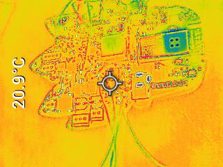
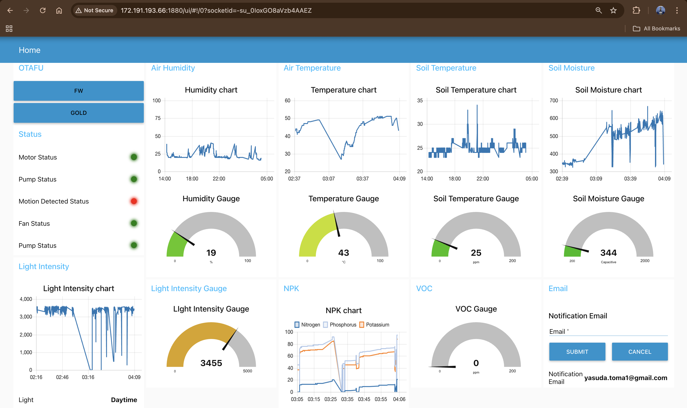

## Team Details

- **Team Number:** T13  
- **Team Name:** DreamCatcher  
- **Team Members:**  
  - Abhik Kumar  
  - Toma Yasuda
- **GitHub Repository URL:** [LINK](https://github.com/ese5160/final-project-t13-dreamcatcher)
- **Website Link:** [LINK](https://ese5160.github.io/PLANT_SURVIVAL_SYSTEM/)
- **Node Red UI:** [LINK](http://172.191.193.66:1880/ui/)

---

## Project Pics

 

Team DreamCatcher at Demo Day – showcasing their innovative plant monitoring system and receiving recognition for their work.

    

    

Hardware views of the plant monitoring system – highlighting sensor integration, compact design, and component layout from multiple angles.

## 1. Video Presentation

- Link: [https://youtu.be/Ixd16mNeDC0](https://youtu.be/Ixd16mNeDC0)
  

  <iframe 
    src="https://www.youtube.com/embed/Ixd16mNeDC0" 
    frameborder="0" 
    allow="accelerometer; autoplay; clipboard-write; encrypted-media; gyroscope; picture-in-picture; web-share" 
    allowfullscreen 
    style="position: absolute; top:0; left: 0; width: 100%; height: 100%;">
  </iframe>

---

## 2. Project Summary

Plant Survival System is an environmental monitoring and response system built using FreeRTOS and a SAMD21 microcontroller. It senses humidity, temperature, light levels, soil moisture, air quality, and detects motion to trigger appropriate actuation responses like fan control, buzzer alarms, pump watering, and motor activation (Puppet control). The system includes UART-based NPK soil nutrient sensing, and is organized into well-isolated drivers with non-blocking asynchronous patterns for sensor polling. Sensor values are pushed to a queue for central processing.

Key Features:
- Asynchronous I2C, UART, and ADC integration
- Interrupt-based motion detection
- Modular peripheral drivers (buzzer, fan, puppet, pump)
- Intelligent threshold-based actuation logic
- Stack watermarks printed for task memory debugging
- Node red based Frontend supports OTU

---

## Description of Test Hardware

- **Development Board:** Atmel SAMD21 Xplained Pro  
- **Sensors:**
  - SHT4x (Temperature and Humidity over I2C)
  - STEMMA Soil Sensor (Capacitive Moisture and Temperature via I2C)
  - SGP40 (VOC Sensor over I2C)
  - Photoresistor (Analog ADC on PB03)
  - PIR Motion Sensor (GPIO interrupt on PB02)
  - NPK Sensor (UART communication on SERCOM5 and RS485 UART module)
- **Actuators:**
  - Fan (GPIO)
  - Buzzer (PWM via TCC2 on PA17)
  - Water Pump (GPIO based on STEMMA Soil Sensor data)
  - Servo Motor (PWM via TCC0 on PA06)
- **Other:**
  - Serial terminal interface over USB for debug
  - FreeRTOS-based multi-tasking architecture

---

## 3. Hardware & Software Requirements

### Hardware Requirements Specification (HRS)

#### Overview
The IoT Plant Monitoring System was developed for real-time plant health monitoring and management using a combination of sensors and actuators. The system was powered by the SAMW25 microcontroller, which provided integrated Wi-Fi communication for data sharing and supported peripherals for environmental monitoring and actuation.

The hardware integrated soil moisture sensors, temperature and humidity sensors, a light sensor, motion sensor, air quality sensor, and a soil NPK sensor. Actuators such as a water pump and motion deterrent system ensured automated responses. The system also featured a microSD card for efficient data logging.

#### Definitions and Abbreviations
- **SAMW25**: Microcontroller with integrated Wi-Fi
- **RTOS**: Real-Time Operating System
- **Li-ion**: Lithium-ion battery

#### Functional Requirements

- **HRS 01**: The SAMW25 microcontroller was used for processing, Wi-Fi communication, and interfacing with peripherals via I2C, SPI, UART, and GPIO.

- **HRS 02**: A capacitive soil moisture sensor measured soil water content (±3% accuracy) via I2C and triggered a water pump when moisture dropped below 30%.

- **HRS 03**: A SHT4x sensor measured temperature and humidity with ±0.5°C and ±2% accuracy. It is used to monitor the environmental condition to help provide the suitable care based on the data.

- **HRS 04**: A photodiode-based light sensor interfaced via ADC and detected lux levels (±2 lux). It helped disable sensors at night to save power.

- **HRS 05**: A soil NPK sensor (via RS485 + UART) measured nitrogen, phosphorus, and potassium levels. It requires only 5V and RS485 module is power vai different system based on the rating (3.3v or 5V module).

- **HRS 06**: A DC water pump (500 ml/min) was activated via GPIO based on soil moisture and adjusted for temperature and weather.

- **HRS 07**: A PIR motion sensor detected objects within 50 cm and triggered a buzzer via GPIO for 5 seconds.

- **HRS 08**: RC filter to get the reference voltage of ADC to the value comparable for microcontroller and reduce the noise in the signal too.

- **HRS 09**: The system ran on a 3.7V 2500mAh Li-ion battery with buck and boost converters for 3.3V, 5V, and 12V lines.

- **HRS 10**: A microSD card (via SPI) logged data from sensors ad firmware images.

- **HRS 11**: A PWM-controlled motor-driven puppet was activated on motion detection to deter animals.

- **HRS 12**: Power and barrel LEDs provided system status.

- **HRS 13**: RS485 interfaced with the NPK sensor and was powered by a 12V boost converter (Can also be powered by 5V based on testing).

- **HRS 14**: An SGP40 sensor monitored VOC levels (0–1000 ppm) via I2C.

- **HRS 15**: A 5V wall adapter powered high-current devices like the pump and fan.

---

### Software Requirements Specification (SRS)

#### Overview
The system software managed real-time sensor data collection, automated actuation, and remote monitoring through Wi-Fi. It was developed using FreeRTOS and integrated cloud support.

#### Definitions and Abbreviations
- **Web Interface**: Platform for user interaction and control
- **Wi-Fi**: Wireless communication protocol
- **GPS**: Global Positioning System

#### Functional Requirements

- **SRS 01**: Sensor data was collected every 1 minute with ±1% sampling accuracy.

- **SRS 02**: Wi-Fi transmitted real-time soil moisture, temperature, humidity, and light data to the cloud.

- **SRS 03**: NPK levels were measured every minute. Alerts were generated if nutrient levels dropped below thresholds.

- **SRS 04**: The water pump activated below 30% soil moisture and turned off above 60%. GPS-based rain forecasts suppressed unnecessary watering.

- **SRS 05**: The PIR motion sensor activated a buzzer and puppet deterrent for 5 seconds upon motion. It was overrideable by button.

- **SRS 06**: GPS coordinates were logged for each plant and used to fetch forecast data.

- **SRS 07**: Notifications were sent via email to alert users about critical conditions like temperature extremes or low nutrients.

- **SRS 08**: Real-time and historical data were visualized through a web interface with graphs and system status.

- **SRS 09**: A microSD card logged timestamped data and used a rolling buffer to manage storage. Data synced with cloud when Wi-Fi was available.

- **SRS 10**: The fan remained on continuously to maintain airflow for stable sensor readings.

---

## 4. Project Photos & Screenshots

### 3D Model for Case

<

### The Altium Board design in 2D view

    

[OUTPUT JOB PDF](IMAGES/T13_S25_OutputJob_File.PDF)

### The Altium Board design in 3D view

      

[3D PDF use Adobe](IMAGES/3D_PCB.pdf)

Design-to-hardware pipeline – starting with vector outlines in Adobe Illustrator, imported into SolidWorks for 3D modeling, then integrated into Altium Designer to finalize the board shape and electrical layout.

### Thermal camera images while the board is running under load
    

    

    

        

System under load testing – validating sensor stability, power management, and communication reliability under operational conditions.

### External sensor

    

### Node-RED Dashboard:

Node-RED Dashboard – visualizing real-time sensor data and system control interface for the plant monitoring application.

### Node-RED Backend:

Node-RED backend dashboard – featuring real-time visualization, control logic, and wireless data monitoring interface.

---

## 5. Block diagram of the system

Comprehensive system diagram – illustrating the functional flow of data between sensors, microcontroller, communication modules, and cloud interface, along with power distribution showing how each component is powered within the plant monitoring setup.

---

## 6. Codebase

- **Embedded C firmware:** [https://github.com/your-repo-url-here/firmware](https://github.com/your-repo-url-here/firmware)
  
- **Node-RED Flow:** [https://github.com/your-repo-url-here/nodered](https://github.com/your-repo-url-here/nodered)

- **Node-RED dashboard code:**[https://github.com/ese5160/final-project-t13-dreamcatcher/blob/main/Node-RED/node-red-final.json](https://github.com/ese5160/final-project-t13-dreamcatcher/blob/main/Node-RED/node-red-final.json)

- **Altium Design:** [LINK](https://upenn-eselabs.365.altium.com/designs/F10B40A4-B2BE-4F72-AF76-706C91D55F7E)
  
- **BOM:** [LINK](IMAGES/A01G_BOM_[DreamCatcher]_Team_13.xlsx)

- **Additional Tools:** 
  - Microchip Studio for development
  - Python of updating the WIFI driver
  - VS code for code search and navigation
  - Saleae Logic Analyzer for waveform analysis
  - Lab Oscilloscope and power supply for testing
  - Custom queue manager for data handling
  - UART timeout-based reading logic for NPK
  - PWM duty-cycle tuning routines for buzzer and fan

---

## Task Breakdown

| Task                    | Description                                       |
|-------------------------|---------------------------------------------------|
| SPI  TASK               | SD Card communication                             |
| I2C Task                | SHT4x, Soil Sensor, SGP40 polling                 |
| ADC Task                | Photoresistor peak sampling                       |
| UART Task               | NPK sensor polling with timeout protection       |
| Motion Handler Task     | Interrupt-based motion activation + actuation    |
| Schedule Task           | Aggregates all sensors and manages pump logic    |

---

## Notes

- Buzzer is driven using TCC2 on PA17
- Servo Motor is driven by TCC1 on PA10
- Pump uses GPIO to toggle ON and OFF
- Fan uses GPIO to toggle ON and OFF
- Non-blocking UART and I2C communication used wherever possible
- All sensor values are debug-printed to serial terminal
- All I2C sensors were grouped to reduce the number of task
- Status of all the Actuators were displayed in Node-red 
- NPK sensor can operates at 5V and the power supply for that might need to be separate than the RS485 (If RS485 is 3.3 V) {No need of 12 V}
- Same TCC doesn't work on multiple pins.
- MCU Internal reference voltage is not 3.3v, so using ADC narrows the resolution.
